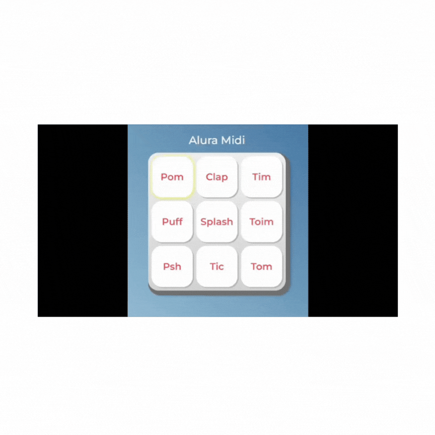

# Alura Midi

## Descrição
O Alura Midi é um instrumento musical de interface digital onde cada botão emite o som de um instrumento. Basta clicar em cada botão do teclado para ouvir o som correspondente.

## Demonstração

## Linguagens Utilizadas

## Como Usar
Para usar o Alura Midi, basta acessar a página e clicar nos botões do teclado para ouvir os sons dos instrumentos.

## Acesso
Você pode acessar o Alura Midi através do seguinte [link](https://aluramidi-omega-five.vercel.app/).

## Licença
Este projeto está licenciado sob a licença MIT.
